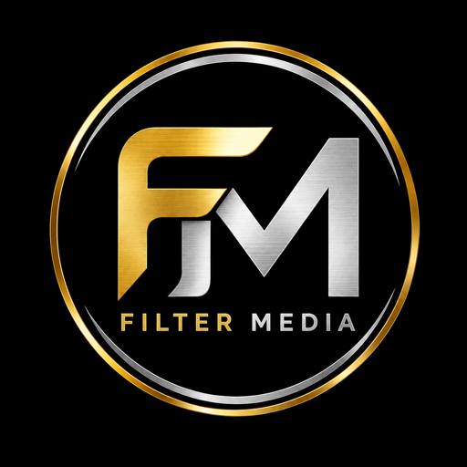
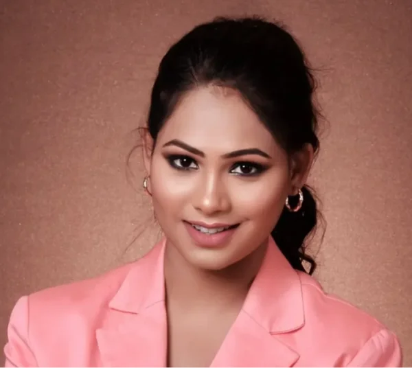
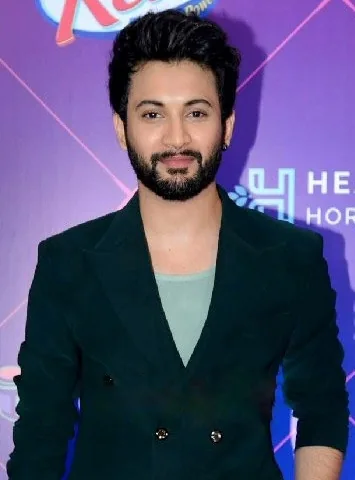
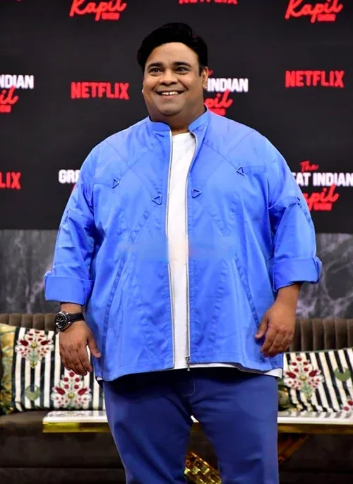
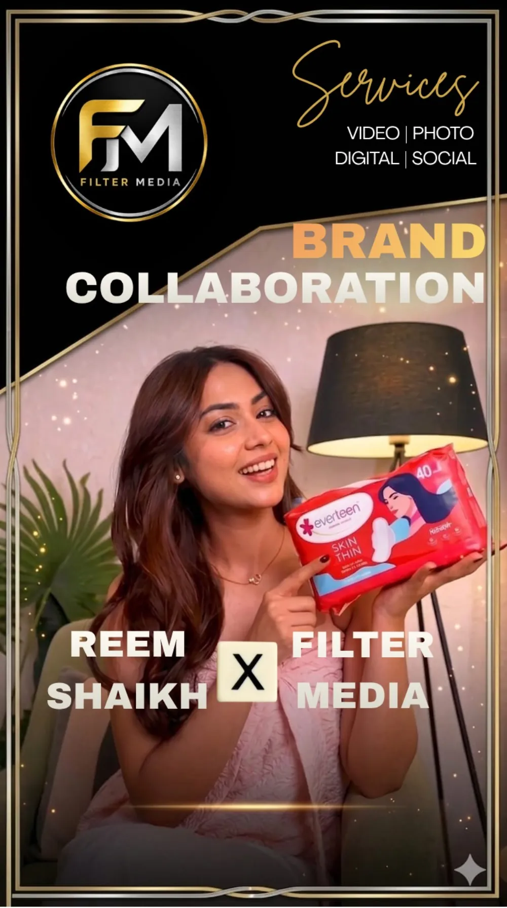
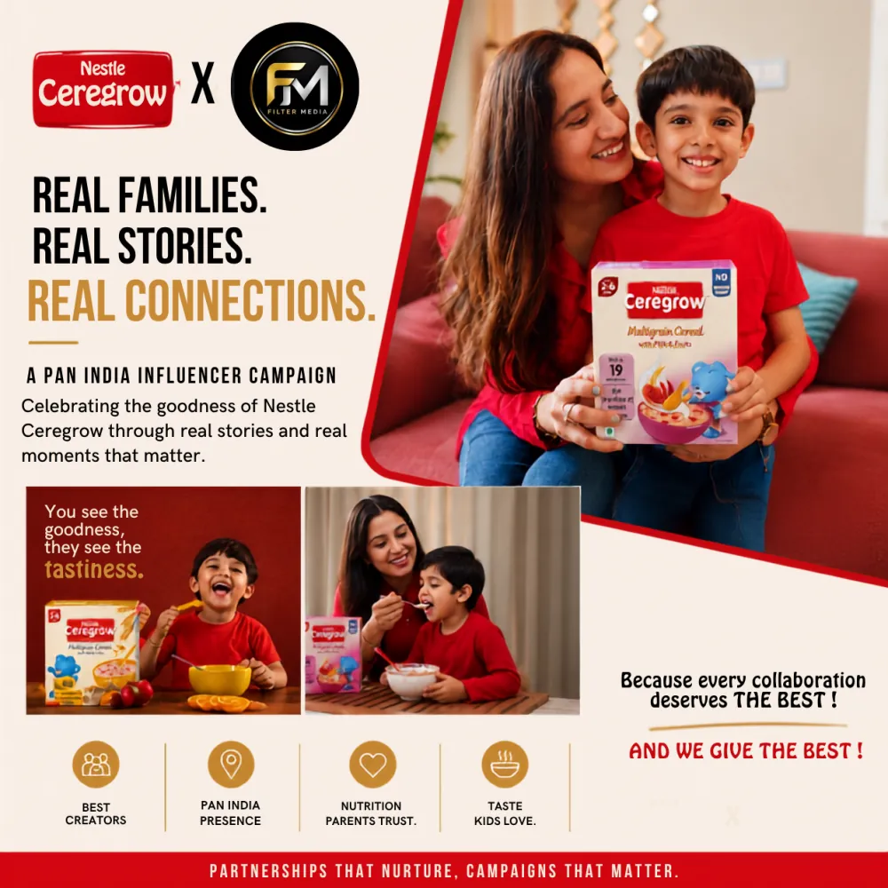
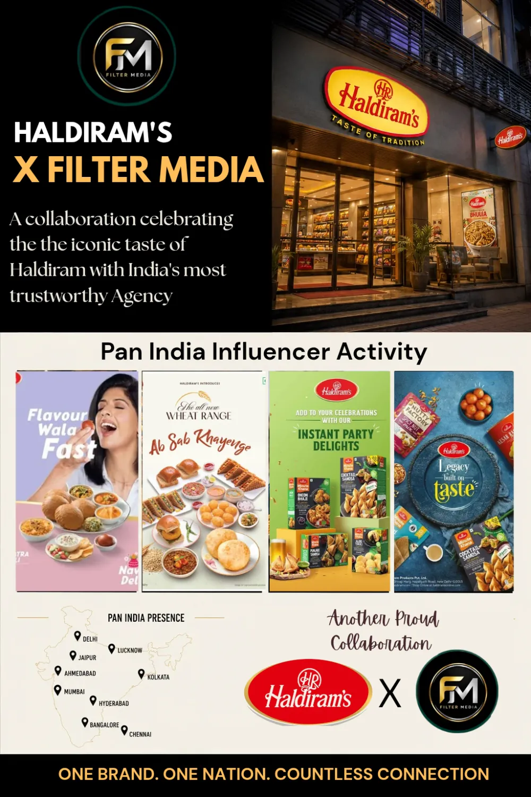
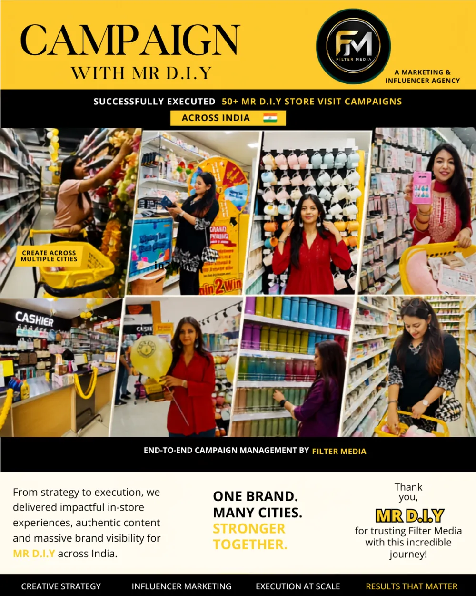
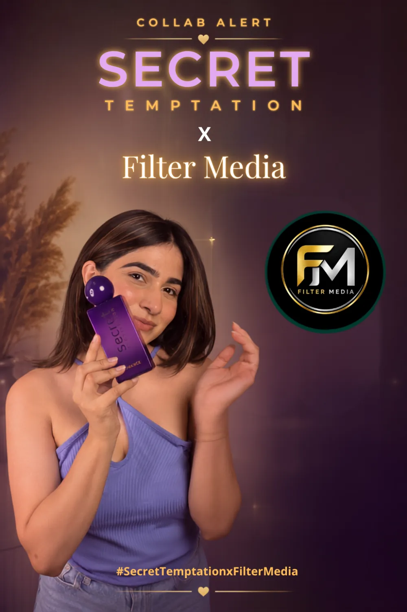

<div align="center">



# Filter Media

### Where Brands Meet Influence

**360° Influencer, Celebrity & Content Marketing Agency · India**

Connecting brands with creators, celebrities & culture — powered by a **1000+ creator network** across India.

[🌐 filtermedia.co.in](https://filtermedia.co.in) · [✉ work@filtermedia.co.in](mailto:work@filtermedia.co.in) · [📱 +91 85120 98300](tel:+918512098300)

[Instagram](https://instagram.com/filtermediaofficial) · [LinkedIn](https://www.linkedin.com/in/ananya-gupta-8028b6171/) · [Facebook](https://www.facebook.com/profile.php?id=61589667240137) · [WhatsApp](https://wa.me/918512098300)

</div>

---

## About Filter Media

Filter Media is a **360° Marketing, Celebrity Marketing, Influencer Marketing, Content Production, Branding, and Advertising agency** — helping brands connect with audiences through creators, celebrities, content, and culture.

Founded in **2026**, we specialise in impactful digital campaigns that combine creativity, strategy, and measurable performance.

| | |
|---|---|
| **Our Vision** | To build impactful connections between brands, creators, and consumers — and become India's most trusted influencer and celebrity marketing agency. |
| **Our Mission** | To create authentic campaigns that drive engagement, trust, and business growth through innovative digital, influencer, and content marketing solutions. |

---

## Founder



**Ananya Gupta** — Founder & CEO

Ananya leads the agency's vision, influencer marketing strategy, celebrity collaborations, and brand partnerships — driving campaigns that connect the right brands with the right creators at the right moment.

- **Vision & strategy** — sets the direction for every campaign and the agency's growth across India.
- **Celebrity & creator partnerships** — personally curates collaborations that put brands at the heart of culture.
- **Brand partnerships** — builds long-term relationships that turn campaigns into measurable business growth.

[Connect with Ananya on LinkedIn →](https://www.linkedin.com/in/ananya-gupta-8028b6171/)

<br clear="right" />

---

## How We Work

A simple, transparent process — so you always know what's happening, who's creating, and what it's delivering.

| Step | | What happens |
|:---:|---|---|
| **01** | **Brief & strategy** | We start with your goals, audience, and budget — then shape a campaign strategy built around them. |
| **02** | **Creator & celebrity match** | We handpick creators and celebrities from our 1000+ network whose audience already loves your category. |
| **03** | **Content & execution** | Scripting, shoots, approvals, and go-live — managed end-to-end so your team stays hands-off. |
| **04** | **Report & optimise** | Reach, engagement, and conversions reported clearly — with learnings rolled into the next campaign. |

---

## Our Creator Network

A pan-India network of **1000+ creators** spanning every niche — so we match your brand with creators whose audience already loves what you do.

| Category | Creators | Focus |
|---|:---:|---|
| Fashion & Style | **250+** | Apparel, accessories, luxury |
| Lifestyle & Vlogs | **220+** | Daily life, family, home |
| Entertainment | **200+** | Comedy, music, celebrities |
| Beauty & Skincare | **180+** | Makeup, grooming, wellness |
| Food & Cooking | **160+** | Recipes, reviews, foodies |
| Tech & Gadgets | **120+** | Reviews, unboxings, gaming |
| Travel | **110+** | Destinations, hotels, culture |
| Fitness & Health | **90+** | Gym, yoga, nutrition |

---

## Celebrity & Creator Collaborations

From established celebrities to rising micro-creators, Filter Media collaborates with India's most engaging voices.

<table>
  <tr>
    <td align="center"><br /><b>Reem Shaikh</b><br />Actress<br /><sub>Everteen Brand Campaign</sub></td>
    <td align="center"><br /><b>Rohit Saraf</b><br />Actor<br /><sub>Vivo Phone Campaign</sub></td>
    <td align="center"><br /><b>Rashami Desai</b><br />Actress<br /><sub>Cesa Hair Care Campaign</sub></td>
    <td align="center"><br /><b>Kiku Sharda</b><br />Actor<br /><sub>Pine Labs Campaign</sub></td>
  </tr>
</table>

---

## Brands We've Worked With

From global tech to homegrown favourites — brands partner with Filter Media to reach India through creators and celebrities.

**Hyundai** · **Vivo** · **Nestlé** · **Haldiram's** · **MR.DIY** · **Pine Labs** · **Everteen** · **Secret Temptation** · **Hollyland** · **Cesa Hair Care** · **Ceregrow** · **RENÉE** · **Trends** · **OZiva** · **Samsung** · **Bioderma** · **DermaTouch** · **Flipkart** · **Myntra Beauty** · *and more*

---

## Case Studies

Real brands. Real creators. Real results — a selection of campaigns executed by Filter Media across India.

| Campaign | Type |
|---|---|
| **Hyundai** × Filter Media | Influencer · Reel |
| **Everteen** × Reem Shaikh | Celebrity Collab |
| **Nestlé Ceregrow** | Pan-India Influencer |
| **Haldiram's** | Pan-India Influencer |
| **MR D.I.Y** | Store-Visit Campaign |
| **Secret Temptation** | Brand Collab |

<table>
  <tr>
    <td align="center"><br /><sub>Hyundai — Influencer Reel</sub></td>
    <td align="center"><br /><sub>Everteen × Reem Shaikh — Celebrity Collab</sub></td>
    <td align="center"><br /><sub>Nestlé Ceregrow — Pan-India Influencer</sub></td>
  </tr>
  <tr>
    <td align="center"><br /><sub>Haldiram's — Pan-India Influencer</sub></td>
    <td align="center"><br /><sub>MR D.I.Y — Store-Visit Campaign</sub></td>
    <td align="center"><br /><sub>Secret Temptation — Brand Collab</sub></td>
  </tr>
</table>

---

## Company at a Glance

<div align="center">

| 1000+ | 50+ | 20M+ | 1000+ | Pan-India |
|:---:|:---:|:---:|:---:|:---:|
| Influencer Network | Campaigns Executed | Monthly Reach | Content Deliverables | Creator Network |

</div>

---

## Work With Us

### For Brands
**Launch a campaign people remember.** Tap into our 1000+ creator network and celebrity partnerships to reach the right audience across India — with strategy, content, and results.

→ [Start a campaign](https://filtermedia.co.in/#contact) or write to [work@filtermedia.co.in](mailto:work@filtermedia.co.in)

### For Creators
**Join India's fastest-growing creator network.** Collaborate with top brands, land paid campaigns, and grow your influence with Filter Media behind you.

→ [Join as a creator](mailto:work@filtermedia.co.in?subject=Creator%20Application%20—%20Filter%20Media)

### Contact

| | |
|---|---|
| ✉ Email | [work@filtermedia.co.in](mailto:work@filtermedia.co.in) |
| ☎ Phone / WhatsApp | [+91 85120 98300](https://wa.me/918512098300) |
| 🌐 Website | [filtermedia.co.in](https://filtermedia.co.in) |
| ◎ Instagram | [@filtermediaofficial](https://instagram.com/filtermediaofficial) |
| in LinkedIn | [Ananya Gupta](https://www.linkedin.com/in/ananya-gupta-8028b6171/) |
| f Facebook | [Filter Media](https://www.facebook.com/profile.php?id=61589667240137) |

---

## About this repository

This repo is the source of the live website at **[filtermedia.co.in](https://filtermedia.co.in)**.

- **Stack** — a single static page (`index.html`) written in vanilla HTML, CSS and JavaScript. No framework, no build step.
- **Fonts** — [Playfair Display](https://fonts.google.com/specimen/Playfair+Display) + [Inter](https://fonts.google.com/specimen/Inter) via Google Fonts.
- **Contact form** — submissions are delivered to `work@filtermedia.co.in` via [FormSubmit](https://formsubmit.co).
- **Hosting** — GitHub Pages on the `main` branch, custom domain configured through `CNAME`.
- **SEO** — `robots.txt`, `sitemap.xml`, Open Graph / Twitter cards and `Organization` JSON-LD are all in `index.html`.

```
.
├── index.html        # the whole site — markup, styles and scripts
├── README.md
├── CNAME             # custom domain for GitHub Pages
├── robots.txt
├── sitemap.xml
├── logo.png          # favicon + social share image
├── logo.webp         # header / footer mark
├── founder.webp
├── creator-*.webp    # celebrity & creator portraits
└── case-*.webp       # case-study creatives
```

**Run locally**

```bash
git clone https://github.com/vickygupta07/website-run-filter-media.git
cd website-run-filter-media
python3 -m http.server 8765
# open http://127.0.0.1:8765
```

**Deploy** — push to `main`; GitHub Pages publishes the change to filtermedia.co.in within a minute or two.

---

<div align="center">

© Filter Media — Where Brands Meet Influence.
360° Influencer, Celebrity & Content Marketing Agency, India.

</div>
